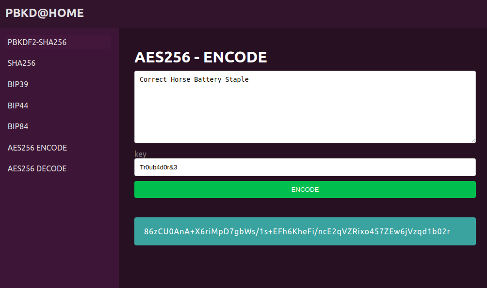

# PBKDATHOME

A KISS, self-hosted tool for Password-Based Key Derivation built with Flask and vanilla JavaScript.

No dependencies, no tracking, no external services, easy to audit.



## Why Another Encoder Tool?

While there are numerous online tools available for encoding, using them requires trust. When dealing with sensitive information, you can't be certain that these services aren't:

- Logging your input
- Tracking your usage
- Acting as honeypots to collect sensitive data
- Manipulating the output

This tool provides a simple, transparent, and self-hosted alternative that you can:
- Inspect (the code is minimal and readable)
- Host locally (data never leaves your network)
- Modify to suit your needs
- Run offline
- Trust (you can verify the SHA256 implementation)

## Features

- Clean, minimal interface
- No external dependencies in the frontend
- Runs completely locally
- Docker-based deployment
- Source code is easy to audit
- Supports any text input
- Encode PBKDF256 and SHA256
- Instant encoding

## Setup

1. Clone this repository:
```bash
git clone [repository-url]
cd pbkdathome
```

2. Build and run with Docker:
```bash
docker compose up --build
```

3. Access the tool at:
```
http://localhost:5000
```

## Project Structure

```
.
├── docker-compose.yml
├── Dockerfile
├── requirements.txt
├── app.py
└── static/
    └── index.html
```

## Security Considerations

- This tool runs entirely in your own environment
- No data is stored or logged
- The encoding implementation uses Python's standard `hashlib` library
- All code is visible and auditable
- No external API calls or resources are used

## Development

Want to improve the tool? Here's how to set up your development environment:

1. Create a virtual environment:
```bash
python -m venv venv
source venv/bin/activate
```

2. Install dependencies:
```bash
pip3 install -r requirements.txt
```

3. Run locally:
```bash
python3 app.py
```

## License

MIT License - Feel free to use, modify, and distribute as needed.

## Contributing

Contributions are welcome! Feel free to:
- Open issues for bugs or suggestions
- Submit pull requests with improvements
- Add new features while maintaining simplicity
- Improve documentation

Remember: The main goal is to keep the tool simple, transparent and stupid to audit.